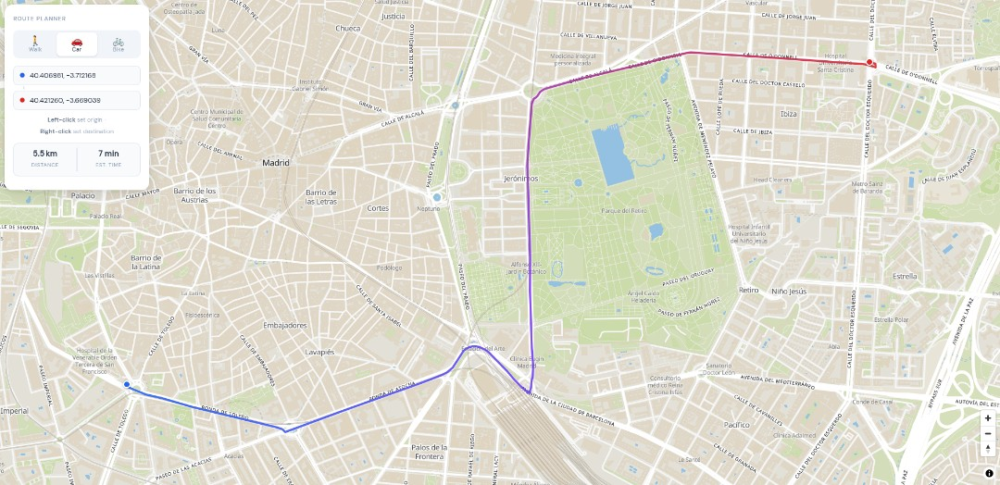

# OpenMapTiles Router Engine

[](https://www.npmjs.com/package/omt-router)
[](./LICENSE)

Client-side routing library for [OpenMapTiles](https://openmaptiles.org/) vector tiles. Computes optimal routes for pedestrian, car, and bicycle travel entirely client-side — no routing backend or third-party service required.

This project is provider-agnostic for OpenMapTiles-compatible vector tiles, so **the same tiles your map is using as basemap can be used for routing!**

Check the live example at [https://abelvm.github.io/omt-router/example](https://abelvm.github.io/omt-router/example)



---

## Features

- **Zero backend, zero-provider** — No need for a routing backend or relying on a 3rd party API provider, `omt-router` builds the routing graph on-the-fly from **OpenMapTiles** formatted vector tiles
- **Multi-engine routing** — bidirectional A*, Adaptive Barrier SSSP, Delta-Stepping, and Ultra Dijkstra
- **Automatic best engine selection** — runtime engine chooser uses benchmark-derived models and a generated selector module in `src/tuning/tuning.js`
- **Three transport modes** — `car`, `pedestrian`, `bicycle`; respects OpenMapTiles access tags and road class hierarchy
- **Two optimization strategies** — route length or travel time
- **Endpoint snapping with quality guard** — nearest-node lookup plus segment-projection snap, with `maxAcceptableSnapDistanceM` limiting distant off-road snaps
- **Seamless tile stitching** — [Liang-Barsky](https://en.wikipedia.org/wiki/Liang%E2%80%93Barsky_algorithm) clipping ensures road segments share bit-identical boundary nodes across neighbouring tiles with no proximity snapping
- **Worker pool + tile cache** — Using [performance-helpers](https://abelvm.github.io/performance-helpers) to get the best performance always: parallel tile parsing and parallel engines execution via **PowerPool**, parsed tiles are cached with **PowerCache** so repeated queries can reuse tiles until TTL/LRU eviction

---

## Documentation

- Isolines / isoPHAST: [src/isolines/README.md](src/isolines/README.md)


## Available routing engines

The library includes multiple engines and selects among them at runtime when `engineId: 'auto'` is used.

| Engine ID | Algorithm | Parallel ready | Best fit |
| --- | --- | :---: | --- |
| `bidirectional-astar` | [Bidirectional A* with geographic heuristic](https://en.wikipedia.org/wiki/Bidirectional_search) |  | Reliable baseline and fallback engine |
| `adaptive-barrier` | [Adaptive Barrier SSSP](https://doi.org/10.48550/arXiv.2504.17033) | ✓ | Dense and medium/large graphs, especially with parallel runtime available |
| `delta-stepping` | [Delta-Stepping SSSP](https://en.wikipedia.org/wiki/Parallel_single-source_shortest_path_algorithm#Delta_stepping_algorithm) | ✓ | Large frontiers and bursty relax phases |
| `ultra-dijkstra` | [Optimized Dijkstra with 4-ary heap](https://doi.org/10.48550/arXiv.1505.05033) |  | Stable performance on sparse or long-route cases |

Notes:

- `queryRoute()` can force a specific engine with `engineId`.
- When an engine returns an invalid/no-path result, the router can fall back to `bidirectional-astar` for correctness.

## ML-based engine selector

Engine selection is data-driven and can be regenerated from benchmark results. `src/tuning/tuning.js` is built from the benchmark pipeline, and `src/tuning/model.js` is the compact runtime model artifact produced by `benchmark/train_engine_selector_ml.py`.

At runtime, the selector evaluates route and graph features such as:

- edge count (`E`) and node count (`N`)
- beeline distance between endpoints
- derived density/branch indicators (`edgesPerKm`, average out-degree)
- discrete feature bands such as `sizeBand`, `beelineBand`, `densityBand`, and `branchBand`

Selector flow:

1. Build the route/graph feature vector from the corridor graph and query endpoints.
2. Detect runtime capability (`SharedArrayBuffer`, Worker, cross-origin isolation) to choose `sabOn` vs `sabOff` rules.
3. Evaluate the generated selector in `src/tuning/tuning.js`, which uses the compact `src/tuning/model.js` artifact when available.
4. Select the recommended engine and apply per-engine parallelization/correctness fallback logic.

Why this exists:

- No single engine is best for every route graph shape.
- The selector minimizes runtime regret using offline benchmark-trained models.
- The training workflow supports both serial (`sabOff`) and parallel (`sabOn`) profiles.
- The model pipeline includes `runtime-linear`, `xgboost`, and a compact 2-layer `mlp` option.

See [benchmark/README.md](benchmark/README.md) for the current benchmark and selector training workflow.

---

## OpenMapTiles data model and tile providers

The routing graph is built from the OpenMapTiles `transportation` layer and mode-specific access tags. In short:

- [OpenStreetMap](https://osm.org) is the source data.
- [OpenMapTiles](https://openmaptiles.org/) defines the vector-tile schema used for classes, subclasses, one-way flags, and mode access tags.
- This library parses those tiles in workers and builds a local routing graph on demand.

Schema reference used by this project:

- [OpenMapTiles transportation schema](https://openmaptiles.org/schema/#transportation)

You can use tiles providers, or download a tiles dataset ([OpenFreeMap](https://github.com/hyperknot/openfreemap#full-planet-downloads), [Maptiler](https://www.maptiler.com/on-prem-datasets/planet/), etc) and serve it yourself (I recommend [Maplibre Martin](https://martin.maplibre.org/) to do so)

### OpenFreeMap usage (used by this repository demo)

The demo in `example/` discovers tile URLs from OpenFreeMap metadata:

```js
const metadata = await fetch('https://tiles.openfreemap.org/planet').then((r) => r.json());
const urlTemplate = metadata.tiles[0];
```

OpenFreeMap links:

- Project: [https://openfreemap.org/](https://openfreemap.org/)
- Tile metadata endpoint used in demo: [https://tiles.openfreemap.org/planet](https://tiles.openfreemap.org/planet)

You can also use other OpenMapTiles-compatible providers (for example MapTiler) as long as URL template and CORS requirements are satisfied.

### MapLibre control usage

The library exports `MapLibreRoutingControl` for MapLibre GL JS demos and integrations.

```js
import { MapLibreRoutingControl, route, getEngineWorkerStatus, onEngineWorkerStatusChange, cancelRunningEngine } from 'omt-router';

const control = new MapLibreRoutingControl({
  routeFunction: route,
  getEngineWorkerStatus,
  onEngineWorkerStatusChange,
  cancelRunningEngine,
  tileJsonUrl: 'https://tiles.openfreemap.org/planet',
  maplibre: maplibregl,
});
map.addControl(control, 'top-left');

map.on('click', (e) => control.setOriginFromMap(e.lngLat));
map.on('contextmenu', (e) => {
  e.originalEvent.preventDefault();
  control.setDestFromMap(e.lngLat);
});
```

### `MapLibreRoutingControl` constructor options

The routing control supports theme selection and custom panel styling via `theme` and `panelClassName`.

| Option | Type | Default | Description |
| --- | --- | --- | --- |
| `maplibre` | `object` | — | Required MapLibre GL JS library object (`maplibregl`) used to create markers and bounds. |
| `tileJsonUrl` | `string` | — | Optional metadata endpoint returning `{ tiles: [urlTemplate] }`. Used when `urlTemplate` is not provided. |
| `urlTemplate` | `string` | — | Optional tile URL template (`{z}/{x}/{y}.pbf`) for vector tiles. If provided, no metadata fetch is needed. |
| `routeFunction` | `function` | `route` | Optional custom route implementation returning the routing result. |
| `getEngineWorkerStatus` | `function` | — | Optional callback that returns the current engine worker status. |
| `onEngineWorkerStatusChange` | `function` | — | Optional subscription hook for engine status changes. |
| `cancelRunningEngine` | `function` | — | Optional cancel callback used when a route request times out or the control is removed. |
| `defaultMode` | `string` | `car` | Initial transport mode: `car`, `pedestrian`, or `bicycle`. |
| `defaultCostField` | `string` | `distance` | Initial cost optimization: `distance`, `travelTime`, or `optimal`. |
| `theme` | `string` | `light` | UI theme for the control panel. Use `auto`, `light`, or `dark`. |
| `panelClassName` | `string` | `` | Additional CSS class(es) added to the control panel root. |
| `routeTimeoutMs` | `number` | `20000` | Route request timeout in milliseconds. |
| `routeOptions` | `object` | `{ maxAutoRadius: 8, maxAcceptableSnapDistanceM: 60 }` | Passed through to the route engine. |
| `showGraph` | `boolean` | `false` | Whether to render the internal graph overlay. |
| `routeSourceId` | `string` | `omtr-route-source` | Map source ID for the route GeoJSON. |
| `routeCasingLayerId` | `string` | `omtr-route-casing` | Map layer ID for the route casing line. |
| `routeLayerId` | `string` | `omtr-route-line` | Map layer ID for the route line. |
| `graphSourceId` | `string` | `omtr-graph-source` | Map source ID for the graph overlay GeoJSON. |
| `graphLayerId` | `string` | `omtr-graph-line` | Map layer ID for the graph overlay line. |
| `mapPosition` | `string` | `top-left` | Suggested MapLibre control position. |
| `startColor` | `string` | `#2563eb` | Start route color. |
| `endColor` | `string` | `#dc2626` | End route color. |
| `locale` | `string` | `auto` | Base locale code to use, or `auto` to detect the browser language. |
| `locale_override` | `object` | — | Partial locale text overrides merged into the selected locale. |
| `localeOverride` | `object` | — | Legacy alias for `locale_override`. |
| `tileUrlTransform` | `function` | — | Optional transformer applied to tile URLs on each request. |
| `tileProxyTemplate` | `string` | — | Optional proxy template for route tile requests. |
| `features` | `string` | `both` | Which features to show in the control panel: `routing`, `isolines`, or `both`. |
| `isolineSourceId` | `string` | `omtr-isoline-source` | Map source ID for isoline GeoJSON polygons. |
| `isolineFillLayerId` | `string` | `omtr-isoline-fill` | Map layer ID for isoline fill polygon. |
| `isolineOutlineLayerId` | `string` | `omtr-isoline-outline` | Map layer ID for isoline outline. |
| `isolineMaxCost` | `number` | `100 (m) / 900 (s)` | Default isoline max cost (interpreted as metres when `costField === 'distance'`, or seconds when `costField === 'travelTime'` or `costField === 'optimal'`). By default the control uses `100` metres for distance-based isolines and `900` seconds (15 minutes) for time-based isolines. The control UI displays minutes automatically for travel-time based cost fields. |

All unspecified text fields in `locale_override` are filled from the selected built-in locale, and unsupported override keys are ignored.

### `MapLibreRoutingControl` instance API

The control exposes these helper methods:

- `setOrigin(lngLat)` — set the origin point and trigger a route update.
- `setDest(lngLat)` — set the destination point and trigger a route update.
- `setOriginFromMap(lngLat)` — helper for map click events to set origin from a `maplibregl.LngLat` object.
- `setDestFromMap(lngLat)` — helper for map context-menu events to set destination from a `maplibregl.LngLat` object.
- `setUrlTemplate(urlTemplate)` — update the tile URL template and refresh the route.
- `setTileJsonUrl(url)` — update the tile metadata URL, fetch the new template, and refresh the route.

The control implements the MapLibre control interface via `onAdd(map)` and `onRemove()`, so it can be added with `map.addControl(control, position)`.

When `map.removeControl(control)` is called, the control automatically shuts down its internal isoline worker and shared tile cache by invoking the shared `dispose()`/`shutdown()` lifecycle.

### Isolines (MapLibre control)

- The `MapLibreRoutingControl` includes an integrated isoline (isoPHAST) UI that computes reachability polygons (GeoJSON) for a selected point.
- UI features: a direction toggle (`From` / `To`), a point input or map pick, and a threshold input with an attached unit (minutes or metres). When `costField` is `travelTime` or `optimal` the control shows the threshold in minutes and automatically converts user input to seconds for the isoline engine; otherwise the threshold is treated as metres.
- When `features === 'both'` the control renders tabs for `Routing` and `Isolines`; switching tabs clears the alternate feature's map layers/sources and also removes any origin/destination markers so the active view remains uncluttered.
- Isoline markers are draggable and recoloured to match the selected direction (uses `startColor` for `from` and `endColor` for `to`). Marker dragend triggers an immediate recalculation; input changes also trigger automatic recalculation (there is no separate "calculate" button).
- Isolines are written to the `isolineSourceId` as a GeoJSON `FeatureCollection`. Each feature receives a `properties.color` value (the control then paints fills/outlines using that property). The control's default fill opacity is 0.3.
- The control shows an inline spinner while isoline calculations run, and will auto-fit the map to isoline results when geometry is returned.
- Concurrency and fallback behavior: isoline calculations use a monotonic calculation id to avoid stale results and call the provided `cancelRunningEngine` hook (reason: `'isoline_cancelled'`) before starting new work. When the worker/pool environment is unavailable the control falls back to invoking the configured `routeFunction` with `includeGraph: true` and computes isolines from the returned graph (this preserves behavior in tests and non-worker environments).
- Defaults: isoline direction is `from`. If `isolineMaxCost` is not provided the control defaults to `100` metres for distance-based isolines, or `900` seconds (15 minutes) for travel-time/optimal isolines.

Example: enabling isolines and programmatic usage

```js
const control = new MapLibreRoutingControl({
  maplibre: maplibregl,
  routeFunction: route,
  getEngineWorkerStatus,
  onEngineWorkerStatusChange,
  cancelRunningEngine,
  tileJsonUrl: 'https://tiles.openfreemap.org/planet',
  features: 'both', // 'routing' | 'isolines' | 'both'
  isolineMaxCost: 100, // metres or seconds depending on costField; default is 100m (distance) or 900s (15min) for travelTime/optimal
});
map.addControl(control, 'top-left');

// set isoline by clicking on the map (control handles mapping when active)
control.setIsolineFromMap({ lng: -3.7038, lat: 40.4168 });

// or set programmatically
control.setIsoline({ lng: -3.7038, lat: 40.4168 });
```

### Localization

Localization is configurable via the `locale` option.

- `locale: 'auto'` (default) detects the browser language and selects a built-in locale.
- `locale: 'en'`, `locale: 'es'`, `locale: 'ca'`, `locale: 'gl'`, etc. forces a built-in locale.
- `locale_override: { ... }` merges custom text overrides into the selected base locale.

You can override the entire UI text set or only a few specific labels. Any missing fields are filled in from the selected base locale, and unsupported values are ignored.

```js
const control = new MapLibreRoutingControl({
  maplibre: maplibregl,
  tileJsonUrl: 'https://tiles.openfreemap.org/planet',
  locale: 'es',
  locale_override: {
    title: 'Mi planificador de rutas',
    modes: { pedestrian: 'Andar', car: 'Auto', bicycle: 'Bici' },
    modeTitles: { pedestrian: 'Caminando', car: 'Conducción', bicycle: 'Ciclismo' },
    optimizeFor: 'Optimizar para',
    costLabels: { distance: 'Más corta', travelTime: 'Más rápida', optimal: 'Óptima' },
    costTitles: {
      distance: 'Ruta más corta',
      travelTime: 'Ruta más rápida',
      optimal: 'Ruta óptima',
    },
    originPlaceholder: 'Origen (lat, lng)',
    destinationPlaceholder: 'Destino (lat, lng)',
    reverseRoute: 'Invertir dirección',
    leftClick: 'Clic izq.',
    rightClick: 'Clic der.',
    setOrigin: 'establecer origen',
    setDestination: 'establecer destino',
    stats: {
      distance: 'Distancia',
      estTime: 'Tiempo estimado',
      travelTime: 'Duración',
    },
    status: {
      tileMetadata: 'Error al cargar metadatos de mosaicos. Revisa la URL y la red.',
      waitingStyle: 'Esperando que el estilo termine de cargar antes de mostrar la ruta.',
      tileUrl: 'URL de mosaico no disponible. Proporciona urlTemplate o tileJsonUrl válido.',
      engineBusy: 'Motor ocupado. Esperando a que termine la ruta actual…',
      calculating: 'Calculando ruta…',
      timedOut: 'El enrutamiento agotó el tiempo y fue cancelado. Prueba otra ruta.',
      cancelled: 'Enrutamiento cancelado.',
      tileCors: 'Solicitud de mosaico bloqueada. Comprueba permisos CORS.',
      poorSnap: 'No se encontró ruta porque los puntos se ajustaron mal. Usa puntos más cercanos a la vía.',
      noNode: 'No se encontró ruta porque un punto no pudo enlazar con la red cargada.',
      noPath: 'No se encontró ruta porque la red está desconectada o el corredor es muy estrecho.',
      incompletePath: 'El motor devolvió una ruta incompleta. Revisa los datos de la red.',
      noRoute: 'No hay ruta entre estos puntos. Puede deberse a una red desconectada o un fallo de enrutamiento.',
      routeErrorPrefix: 'Error de enrutamiento —',
    },
  },
});
```


When a custom locale object is provided, the control resolves the base locale from `locale` (or legacy `language` when present), then merges only supported text keys while preserving the built-in locale shape.

You can customize route settings using `routeOptions` and pass a different tile metadata URL if your provider differs from OpenFreeMap.

---

## Caveats

Route quality depends on source data quality. The better [OpenStreetMap](https://www.openstreetmap.org/) coverage and tagging are in your area, the better the result. If you find inaccuracies, consider [contributing](https://wiki.openstreetmap.org/wiki/How_to_contribute) to improve OSM data.

Endpoints must snap to routable graph edges. The routing code first looks for the nearest graph node, then it may use a segment-projection snap when that improves route validity. Snapping is guarded by `maxAcceptableSnapDistanceM` (default `60` m), so points that are too far from a usable road/path will fail with `no_node` or `poor_snap` rather than producing a misleading route.

For bidirectional streets, the side of the road you click can still affect the computed route, especially when one-way restrictions are present.

Tile requests are performed in-browser from a Worker. Your tile server must include CORS headers (for example `Access-Control-Allow-Origin`) for uncached cross-origin requests. If that is not possible, route tile URLs through a same-origin proxy (see `options.tileProxyTemplate`).

---

## Installation

```bash
npm install omt-router
```

---

## Quick start

```js
import { route } from 'omt-router';

const metadata = await fetch('https://tiles.openfreemap.org/planet').then((r) => r.json());
const urlTemplate = metadata.tiles[0];

const result = await route(
  [-3.7038, 40.4168],   // origin  [lng, lat]
  [-3.6937, 40.4101],   // destination
  'car',                // 'car' | 'pedestrian' | 'bicycle'
  urlTemplate,
  { costField: 'travelTime' } // 'distance' | 'travelTime' | 'optimal'
);

console.log(result.found);        // true
console.log(result.coordinates);  // [[lng, lat], ...]  — draw on a map
console.log(result.cost);         // total route cost for the selected costField
```

MapTiler (or another provider) also works:

```js
const urlTemplate =
  'https://api.maptiler.com/tiles/v3-openmaptiles/{z}/{x}/{y}.pbf?key=YOUR_KEY';
```

The returned object:

| Field | Type | Description |
| --- | --- | --- |
| `found` | `boolean` | Whether a path was found |
| `path` | `number[]` | Sequence of internal node IDs |
| `coordinates` | `[number, number][]` | `[lng, lat]` pairs ready for GeoJSON |
| `cost` | `number` | Total route cost (`distance` in metres or `travelTime` in seconds) |
| `costField` | `string` | Cost field used to optimize the route (`optimal` uses priority-weighted travel time) |
| `partialGraph` | `boolean` | `true` when route was computed against a partial graph with missing tiles |

---

## API

### `route(start, end, mode, urlTemplate, options?)`

High-level convenience function. Fetches the necessary tiles, builds the graph, and returns the route.


| Parameter | Type | Default | Description |
| --- | --- | --- | --- |
| `start` | `[lng, lat]` | — | Origin coordinate |
| `end` | `[lng, lat]` | — | Destination coordinate |
| `mode` | `string` | — | `'car'`, `'pedestrian'`, or `'bicycle'` |
| `urlTemplate` | `string` | — | MVT tile URL with `{z}`, `{x}`, `{y}` placeholders |
| `options.zoom` | `number` | `14` | Tile zoom level |
| `options.schema` | `string` | `'zxy'` | Tile schema: `'zxy'` or `'tms'` |
| `options.radius` | `number` | `auto-computed` | Optional fixed tile radius around the route corridor |
| `options.maxAutoRadius` | `number` | `8` | Maximum radius used by adaptive retry loop (floored to integer and clamped ≤ 10) |
| `options.engineId` | `string` | `auto` | Engine selector hint: `'auto'` (default) or one of `'bidirectional-astar'`, `'adaptive-barrier'`, `'delta-stepping'`, `'ultra-dijkstra'`. When `'auto'`, the runtime selector chooses the engine. |
| `options.costField` | `string` | `'distance'` | Route optimization target: `'distance'`, `'travelTime'`, or `'optimal'` |
| `options.penalties` | `object` | `{ intersectionPenaltySec: 0, turnPenaltySec: 0, turnAngleThresholdDeg: 25 }` | Travel-time penalty controls: `intersectionPenaltySec` is applied during graph preparation (`buildCH()`); `turnPenaltySec` is accepted but currently ignored by engine routing; `turnAngleThresholdDeg` is validated. |
| `options.maxAcceptableSnapDistanceM` | `number` | `60` | Maximum allowed snap distance from endpoint to graph node |
| `options.includeGraph` | `boolean` | `false` | When true, the returned result includes the prepared `graph` object (useful for debugging). |
| `options.tileProxyTemplate` | `string` | — | Optional same-origin proxy template. Supports `{url}` (encoded), or the template may be concatenated with the encoded tile URL; placeholders `{z}`, `{x}`, `{y}` are also supported. |
| `options.tileUrlTransform` | `(rawUrl, tile) => string` | — | Optional per-tile URL rewrite hook. Must return a string; otherwise an error is thrown. |

The route result also includes runtime metadata fields such as `engine`, optional `fallback`, `startSnapDistanceM`, `endSnapDistanceM`, and diagnostic fields `partialGraph`, `hasMissingTiles`, and `missingTileErrors`. `partialGraph` is `true` whenever the route was calculated against a graph with missing tiles. On failure the result includes a `reason` (for example `no_path`, `no_node`, `poor_snap`, `incomplete_path`, `tile_cors`).

### CORS and `MissingAllowOriginHeader`

If `route()` returns `reason: 'tile_cors'` with `code: 'MissingAllowOriginHeader'`, the browser blocked a cross-origin uncached tile request.

On some providers, auth/quota errors (for example HTTP 403 or 429) may also be returned without CORS headers, which appears as a CORS failure in browser logs. Verify your API key, quota, and origin allowlist first.

You can fix this in one of two ways:

1. Configure the tile server to include `Access-Control-Allow-Origin` for your app origin.
2. Use a same-origin proxy and set `tileProxyTemplate`.

For MapTiler specifically, ensure `http://localhost:5173` is allowed for your key during local development.

For the example app in this repository, provide your key using either:

1. `VITE_MAPTILER_KEY=YOUR_KEY npm run dev`
2. `http://localhost:5173/example/index.html?key=YOUR_KEY`

Example:

```js
const result = await route(start, end, 'car', urlTemplate, {
  tileProxyTemplate: '/api/tile-proxy?url={url}',
});
```

### `computeRoute(startCoords, endCoords, graph, options?)`

Runs the routing algorithm on a pre-built graph. Useful when you manage tile loading yourself.
Route optimization modes:

- `distance`: shortest path by route length in metres.
- `travelTime`: fastest path by travel time in seconds.
- `optimal`: priority-weighted travel-time path that prefers higher-priority road classes using OpenMapTiles class weights and an alpha factor.

Key options:

- `costField`: `'distance'`, `'travelTime'`, or `'optimal'`
- `penalties`: same structure as `route()`
- `snapDistancesM`: snap search ladder (default `[250, 500, 800]`)
- `maxAcceptableSnapDistanceM`: snap-quality guard (default `60`)
- `graphCategory`: optional selector hint (`city-center`, `city-consolidated`, `suburban`, `countryside`)
 - `engineId`: `'auto'` or one of `'bidirectional-astar'`, `'adaptive-barrier'`, `'delta-stepping'`, `'ultra-dijkstra'`. When provided, forwarded to `queryRoute()` as an engine selection hint.

### `buildCH(graph, costField?)`

Flattens a graph into typed arrays and forward/reverse CSR adjacency ready for engine execution. `costField` can be `'distance'` (metres, default), `'travelTime'` (seconds), or `'optimal'` (priority-weighted travel time using `WAY_PRIORITIES`).

### `queryRoute(startId, endId, prepared, options?)`

Runs route search on a `buildCH`-prepared graph using either an explicit engine or `engineId: 'auto'`.

Key options:

- `engineId`: `'auto'`, `'bidirectional-astar'`, `'adaptive-barrier'`, `'delta-stepping'`, `'ultra-dijkstra'`
- `graphCategory`: optional selector hint
- `costField`: `'distance'` or `'travelTime'`
- `useCache`: enable route-result cache (default `true`)
- `allowFallback`: retry with `bidirectional-astar` on invalid/no-path non-baseline results (default `true`)
- `forceSerialRouting`: disable parallel policy for this query (default `false`)

### `nearestNode(coords, graph, maxDistM?)`

Returns the ID of the graph node closest to `coords` within `maxDistM` metres (default 500 m).

---

## Architecture

```text
route()
  │
  ├─ tilesManager  →  corridor tiles (+ adaptive radius retries)
  │
  ├─ graphBuilder
  │    ├─ PowerPool workers  →  fetch + parse transportation layer
  │    ├─ PowerCache         →  per-tile parse cache
  │    └─ mergeSegments      →  graph nodes/edges with distance + travelTime
  │
  └─ chRouter
      ├─ buildCH            →  typed arrays + forward/reverse CSR
      ├─ nearestNode        →  endpoint snapping via KDBush
      └─ queryRoute         →  auto engine select, worker run, validate, fallback
```

### 1. Tile corridor — `tilesManager.js`

`getTilesAlongLine` uses a [**Bresenham line-rasterisation**](https://en.wikipedia.org/wiki/Bresenham%27s_line_algorithm) algorithm to enumerate slippy-map tiles around the origin-to-destination corridor.

In `route()`, corridor radius can auto-expand when a pass fails with `no_path`, `no_node`, `poor_snap`, or `incomplete_path`. This keeps normal requests small while still handling larger real-world detours.

The tile retry loop also means route failure reasons are more informative: `no_node` means no nearby graph node was found, `poor_snap` means endpoint snapping quality exceeded `maxAcceptableSnapDistanceM`, and `incomplete_path` means the selected engine produced an invalid route that will be retried or surfaced to the caller.

Both `zxy` (XYZ) and `tms` (TMS, Y-flipped) schemas are supported.

### 2. Graph construction — `graphBuilder.js`

Each tile is parsed independently in a [**`PowerPool`**](https://abelvm.github.io/performance-helpers/#/powerpool) worker, so decode work scales with available CPU cores. Parsed tile outputs are stored in a [**`PowerCache`**](https://abelvm.github.io/performance-helpers/?page=lru-cache-with-ttl-and-memoizer) keyed by tile URL; repeated queries over the same area skip network and parsing.

**Tile parsing (`parseTile`):**

1. Decodes the MVT `transportation` layer using `@mapbox/vector-tile` + `pbf`.
2. Filters features by transport mode using the [OpenMapTiles transportation schema](https://openmaptiles.org/schema/#transportation) — road class, subclass, and access tags (`access`, `foot`, `bicycle`, `oneway`).
3. Clips every road segment to the exact tile boundary using [**Liang-Barsky parametric line clipping**](https://en.wikipedia.org/wiki/Liang%E2%80%93Barsky_algorithm). Because the clip interpolation uses the same floating-point arithmetic in both adjacent tiles, the boundary coordinate is bit-identical — no proximity snapping is needed to stitch the graph at tile seams.
4. Projects tile pixel coordinates to `[lng, lat]` using precomputed per-tile scale constants (avoids repeated `Math.pow` / trig per vertex).

**Graph merge (`mergeSegments`):**

Segments from all tile workers are merged on the main thread. Node deduplication is done via a `coordKey` hash (coordinates rounded to 6 decimal places ≈ 0.1 m). Each unique node gets a sequential integer ID. For every segment an edge is added with:

- `cost` — forward traversal cost (haversine metres, or −1 if `oneway = -1`)
- `reverseCost` — backward traversal cost (haversine metres, or −1 if `oneway = 1`)
- `travelTime` — `length / speed` in seconds, where speed comes from per-class defaults

### 3. Route preparation and endpoint snapping — `chRouter.js`

#### Graph flattening (`buildCH`)

Converts the merged graph into compact typed arrays and CSR adjacency for both forward and reverse traversal. Costs are stored as scaled integers (`DIST_SCALE = 10`) for stable and fast inner-loop arithmetic.

#### Nearest node lookup (`nearestNode`)

Endpoints are snapped to graph nodes with a cached `KDBush` spatial index and a configurable max snap distance.

### 4. Routing execution and engine selection — `chRouter.js`

`queryRoute` supports explicit engine IDs and an `auto` mode. In `auto`, the selector in `src/tuning/tuning.js` uses route and graph features (`E`, `N`, beeline, density and branching bands) plus runtime capability (for example SharedArrayBuffer and Worker availability) to choose the best engine for each query.

Execution flow:

1. Select engine (`auto` or explicit).
2. Apply per-engine parallel policy when runtime allows it.
3. Run in engine worker when available, otherwise run on main thread.
4. Validate returned route geometry and cost.
5. If invalid or no path from a non-baseline engine, retry with `bidirectional-astar` for correctness.

The returned result includes selected engine metadata and fallback information when a retry path was used.

---

## Transport modes and road classes

Road filtering follows the [OpenMapTiles transportation schema](https://openmaptiles.org/schema/#transportation):

| Mode | Allowed classes | Excluded |
| --- | --- | --- |
| `car` | motorway(_link), trunk(_link), primary(_link), secondary(_link), tertiary(_link), minor, service, track | pedestrian/footway/cycleway/steps/bridleway/corridor subclasses |
| `pedestrian` | path, minor, service, track (+ pedestrian/footway/steps/path/corridor/platform subclasses) | motorways and non-foot-access roads |
| `bicycle` | path, minor, service, tertiary, secondary, track (+ cycleway/path subclasses) | motorway, motorway_link, non-bicycle-access roads |

Per-class default speeds (km/h) are used to compute `travelTime` edges (motorway 120 → path/pedestrian 5).

---

## Development

```bash
npm install        # install dependencies
npm run dev        # Vite dev server (serves example/)
npm run build      # build library to dist/
npm run test       # run Vitest test suite
npm run lint       # ESLint
npm run format     # Prettier
```

The `example/` directory contains a full MapLibre GL JS demo with a routing panel control. Serve it via `npm run dev` and open `http://localhost:5173/example/`.

---

## License

[AGPL-3.0-only](./LICENSE) © Abel Vázquez Montoro
